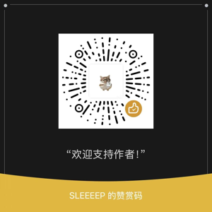

# ▶️ YouTube 下载器 · YouTube Downloader

> 基于 **yt-dlp** 引擎的中文傻瓜壳：自动探测代理、一键选择画质、可选图形界面。
> 不用记任何 yt-dlp 参数，粘贴链接就能下。

```bash
python yt_dl.py "https://www.youtube.com/watch?v=xxxxx"
```

## ✨ 功能特性

- ✅ **一键下载**：粘贴链接即下，常用画质（最佳 / 1080P / 720P / 480P / MP3）
- ✅ **代理自适应**：自动探测 Clash / v2rayN 等常见本地代理端口，也可手动指定或关闭
- ✅ **自动安装引擎**：未检测到 yt-dlp 时自动 `pip install`，零门槛
- ✅ **图形界面**：`--gui` 打开中文窗口，适合小白
- ✅ **播放列表支持**：`--playlist` 一键下载整个列表
- ✅ **文件名安全**：自动处理 Windows 非法字符
- ✅ 音频提取（MP3），需 ffmpeg（未装时自动降级）

## 📦 安装

```bash
pip install yt-dlp
# 可选（MP3 / 高清合并）：
# winget install ffmpeg
```

## 🚀 使用

### 命令行
```bash
python yt_dl.py "https://www.youtube.com/watch?v=xxxxx"              # 最佳画质
python yt_dl.py "<链接>" -f 1080p                                      # 1080P
python yt_dl.py "<链接>" -f mp3                                        # 仅音频
python yt_dl.py "<播放列表链接>" --playlist                            # 整个列表
python yt_dl.py "<链接>" --proxy http://127.0.0.1:7897                # 手动指定代理
python yt_dl.py "<链接>" --no-proxy                                    # 直连（海外可用）
```

### 图形界面
```bash
python yt_dl.py --gui
```

## 🙏 致谢

- 下载引擎基于 [yt-dlp](https://github.com/yt-dlp/yt-dlp)（Unlicense / 公有领域）
- 本项目为 yt-dlp 的中文**封装与增强**（代理探测、画质预设、GUI、自动安装），全部封装代码为独立实现

## ⚠️ 免责声明

本工具**仅用于学习研究及个人合理使用**。

- 请遵守您所在国家/地区的法律法规以及 YouTube 服务条款，尊重创作者与版权所有者权益。
- 请勿将本工具用于任何**商业用途**、**侵权用途**，或批量下载、再分发受版权保护的内容。
- 使用本工具产生的任何风险与法律责任由使用者自行承担。
- 如内容侵犯了您的合法权益，请联系我们，我们将第一时间移除相关链接与内容。

## ☕ 支持作者

如果这个工具帮到了你，欢迎扫码赞赏支持，让我有动力持续更新下去～



## 📄 License

[MIT](./LICENSE) © 2026 qgeng1465
